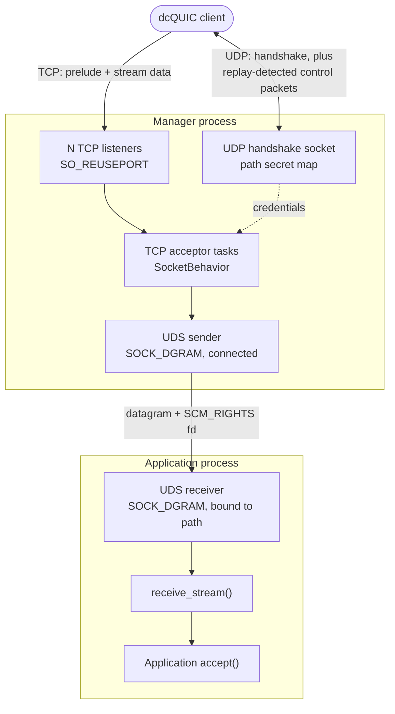
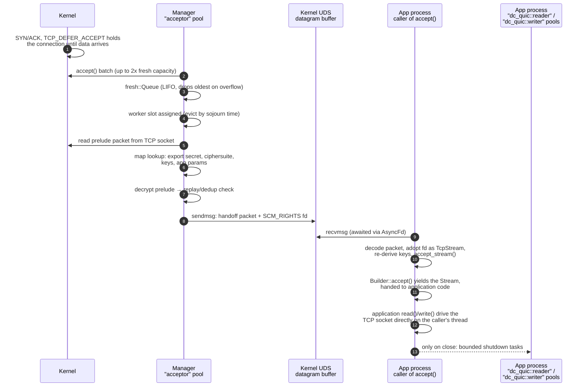
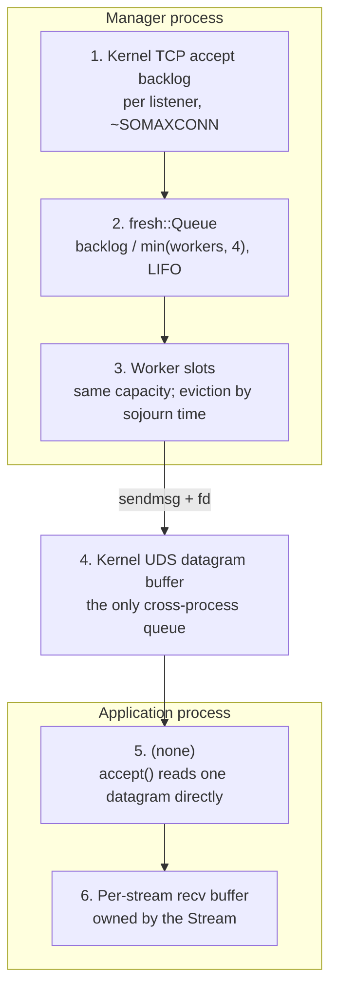

# TCP Acceptor

By default we bind min(# of vCPUs, 4) -- though configurable by applications
via `with_workers` -- listening sockets to the configured listening address. On
Linux, each socket is configured with `TCP_DEFER_ACCEPT` to reduce CPU churn
when accepting sockets[^1]. Sockets are also configured with the maximum kernel
backlog supported on the system. On Linux this is normally 4096 (this is not
configurable). Each listening socket has a Tokio task which:

[^1]: otherwise we accept, register with epoll, and typically near-immediately
      read the prelude packet + deregister from the acceptor runtime's epoll
      before forwarding to the application, which adds a bunch of CPU cycles for
      little reason.

1. Calls accept() up to 2x the per-worker stream queue capacity from the
   listening socket.
   - Enqueues into stream queue (capacity is the application configured backlog
     (default `SOMAXCONN`) divided by with_workers). Retains more recent
     sockets if we overflow.
   - See fresh.rs.
2. Assigns newly accepted streams into "worker slots". On overflow, we choose
   whether to evict an existing worker or keep the new stream based on the
   estimated sojourn time of existing worker slots. This is clamped to
   between 1 and 5 seconds (so slots always retain a stream for at least 1
   second, and evict after at most 5).
   - See manager.rs's `next_worker`.
3. Each worker slot is then polled to possibly make progress. Workers attempt
   to read a prelude packet, then derive stream credentials, and enqueue the
   stream for sending to the application.

There are two "behaviors" which support different modes of accepting sockets.
The DefaultBehavior is for same-process accepting. SocketBehavior sends
accepted streams over a Unix domain socket to a different process alongside the
derived credentials for the stream.

## What is checked for incoming streams

The incoming stream's prelude packet is used to derive credentials. If
credentials are not available (UnknownPathSecret), an UnknownPathSecret secret
control packet is encoded and written into the stream. This will bubble out as
either UnknownPathSecret error or a Send error (if encoding the packet fails).

Replay detection is not performed within the acceptor for DefaultBehavior. This
is deferred to when the application attempts to decrypt the first packet (which
will actually be the InitialPacket, typically carrying an empty payload, but
not guaranteed). The InitialPacket is left in the stream buffer for the first
application read() call. For SocketBehavior, the replay detection is performed,
as it cannot be deferred to the other process (which lacks access to the path
secret map).

Replay detection errors are sent back to the client process over UDP (to the
client handshake address). The stream socket itself is closed with no error
sent over the TCP stream in all cases, typically as a ConnectionReset.

## TLS support

Both modes support detecting a TLS client hello as part of receiving the
prelude packet. SocketBehavior will reject such streams, but DefaultBehavior
accepts them and forwards them into a separate runtime for TLS handshaking
if TLS handshakes were enabled at construction time. Once handshaking
completes, the stream is forwarded into the same application accept queue.

# Unix domain cross-process architecture

The Unix domain socket (UDS) mode splits accepting across two processes:

- A **manager process** (`server::manager`) owns the TCP listening sockets, the
  path secret map, and the UDP handshake socket. It is the only process that
  needs handshake state, so a host can share one set of dcQUIC credentials
  across many unrelated application processes.
- One or more **application processes** (`server::application`) receive
  already-accepted streams from the manager and hand them to application code
  via `accept()`.

The manager runs the exact same TCP acceptor described above -- same listening
sockets, same fresh queue, same worker slots -- but parameterized with
`SocketBehavior` instead of `DefaultBehavior`. Only the terminal step differs:
rather than pushing a `stream::application::Builder` into an in-process channel,
it hands the accepted socket's file descriptor plus the derived key material to
another process.

The transport is a `SOCK_DGRAM` Unix socket. The manager sends one datagram per
stream; the socket's file descriptor rides along in an `SCM_RIGHTS` control
message, so the kernel installs a new descriptor referring to the same socket in
the receiving process. Because the transport is datagram-based rather than
stream-based, each `recvmsg` yields exactly one whole stream handoff, with no
framing or partial-read handling required.

## Process and socket topology

Note that the two error paths leave by different routes: a replay-detected error
goes back to the client's handshake address over UDP via the map's control
socket, while an UnknownPathSecret control packet is written into the TCP stream
itself before it is closed.

The application process never talks to the client's handshake address and never
holds a real path secret map. It constructs a placeholder `Map` purely to
satisfy the stream construction API; all authentication decisions were already
made by the manager.

## The handoff packet

The manager sends a small encoded packet (see `packet/uds/encoder.rs`) next to
the descriptor:

| Field | Purpose |
| --- | --- |
| packet version | forward compatibility of this local wire format |
| ciphersuite | which ciphersuite to rebuild keys under |
| export secret | the entry's export secret, used to re-derive stream keys |
| app params version + `ApplicationParams` | flow control / MTU / limits negotiated for the path |
| encode time | `CLOCK_MONOTONIC_RAW` microseconds, used to measure cross-process transfer time |
| payload | the prelude bytes already read off the TCP socket, still encrypted |

Two consequences worth noting:

- The **export secret**, not the derived stream keys, crosses the boundary. The
  application process re-derives an `ApplicationPair` from it using the key ID
  taken from the prelude's credentials. Since the socket is local and unnamed
  from the sender's side, anyone who can write to the socket path can inject
  streams; access control on the socket path is the application owner's
  responsibility (see `with_socket_path`'s documentation).
- The prelude payload is forwarded **still encrypted**. The manager decrypts it
  only to validate it (and to force the replay-detection check to run), then
  discards the plaintext and forwards the original bytes. The application
  process therefore decrypts the same prelude a second time, this time with
  `Dedup::disabled()` because deduplication already happened in the manager --
  the only process holding the map that could answer the question.

## Queues and threads a stream traverses

The swimlanes below are distinct thread pools (or, for the kernel lanes, buffers
the streams sit in between them). The queues themselves are called out in the
diagram that follows.

### Where the queues actually are

The important asymmetry: in the same-process (`DefaultBehavior`) design there is
a userspace `mpmc` accept queue between the acceptor tasks and the application,
along with a pruner task and sojourn-time statistics for it. In UDS mode that
queue does not exist on the application side. `application::Server::accept()`
issues one `recvmsg` per call, so the kernel's datagram receive buffer for the
Unix socket *is* the accept queue. Overflow there manifests as the manager's
`sendmsg` returning `WouldBlock`; the `SendMsg` future then parks the worker slot
in `WorkerState::Sending` until the socket is writable again, which applies
backpressure into the manager's worker slots rather than dropping the stream. A
slow application process therefore shows up as rising sojourn times and slot
eviction in the manager.

### Threads

- **Manager, `"acceptor"` pool** (multi-thread Tokio, `worker_threads =
  concurrency`): runs the per-listener acceptor tasks. All prelude reads, map
  lookups, replay checks, and `sendmsg` calls happen here.
- **Application process, caller's thread**: `receive_stream()` is a plain
  `async fn` awaited by whoever calls `accept()`. There is no dedicated acceptor
  runtime in the application process -- the decode, fd adoption, and key
  re-derivation all run on the calling task.
- **Application process, `"dc_quic::reader"` / `"dc_quic::writer"` pools**:
  created by the stream `Environment`. For TCP-based streams these pools do not
  get per-stream worker tasks (`read_worker` and `write_worker` are `None` for
  TCP, since the reliable transport needs no separate recovery worker). Their
  handles are still attached to the reader and writer halves and are used for
  spawning the bounded shutdown tasks when a half is closed.

## Ownership of the file descriptor

Tracking the descriptor is worth being explicit about, since a leak here is a
long-lived resource leak:

1. The manager accepts a `std::net::TcpStream` and wraps it in
   `LazyBoundStream` while the prelude is read.
2. On success it converts back to a `std::net::TcpStream`, then into an
   `OwnedFd`, which is moved into the `SendMsg` future.
3. `sendmsg` with `SCM_RIGHTS` duplicates the descriptor into the receiving
   process. The manager's `OwnedFd` is dropped when the future completes,
   closing its copy; the socket stays alive because the receiver now holds a
   reference.
4. The receiver wraps the incoming raw fd in an `OwnedFd`, sets it non-blocking,
   and converts it into a Tokio `TcpStream` registered with the application
   process's reactor.

`MSG_CMSG_CLOEXEC` is set on receive (and `FD_CLOEXEC` applied manually on
non-Linux) so a forked child cannot inherit accepted streams. If a sender sends
more descriptors than expected, the extras are closed explicitly; the one
remaining leak path is documented in `uds/receiver.rs` and requires a local
sender deliberately overflowing the control-message buffer.

On errors anywhere in the manager's path -- unknown credentials, decrypt
failure, or a TLS client hello, which `SocketBehavior` rejects -- the socket is
closed in the manager with `SO_LINGER` set to zero, so the client sees a reset
and the application process never learns the stream existed.

## Current limitations

- Only dcQUIC streams over TCP are forwarded. The UDP paths in `manager.rs` are
  stubbed (`// TODO UDP`).
- TLS streams are rejected rather than forwarded, since the handshake would need
  to happen in the process holding the TLS configuration.
- `application_data` is not carried across the boundary: the application
  process's map does not contain the credential ID the manager used, so
  `accept_stream` is called with `None`.
- The connection ID used in events is still a placeholder (`id: 0`) on both
  sides.
